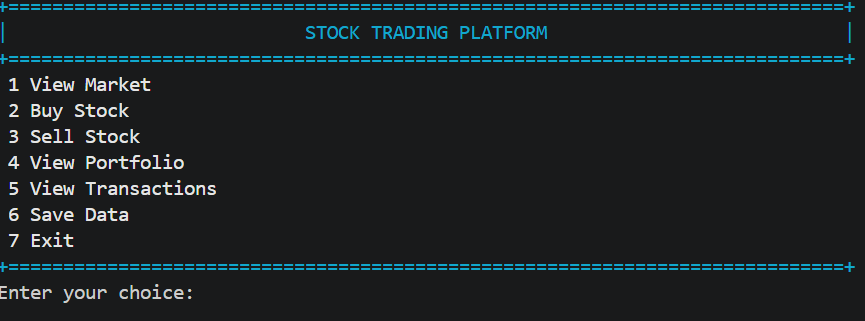
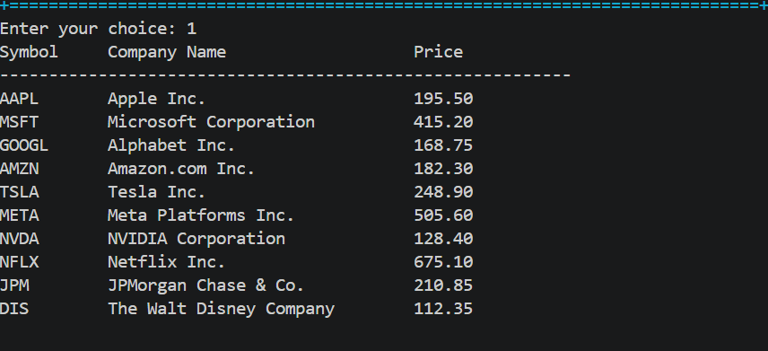
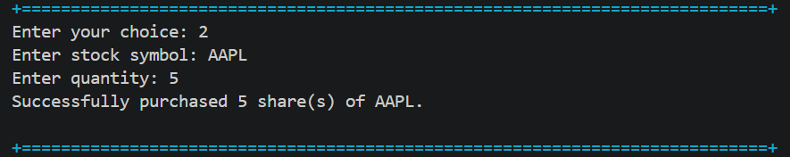
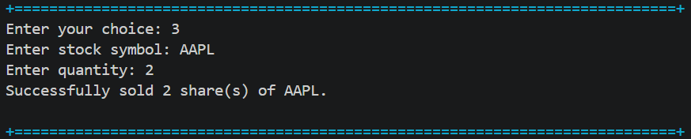
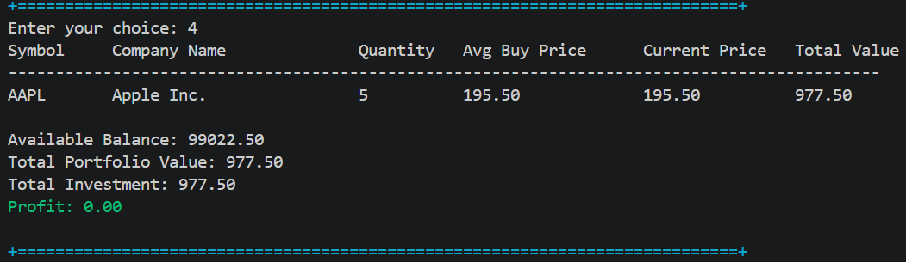
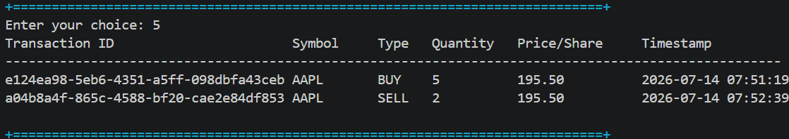

# 📈 Stock Trading Platform

A professional Java console-based **Stock Trading Platform** developed as part of the **CodeAlpha Java Programming Internship**. The application simulates a real-world stock trading environment where users can view market data, buy and sell stocks, manage their portfolio, and track transaction history with persistent file storage.

---

## 🚀 Features

- 📊 View available stocks with current prices
- 💰 Buy stocks
- 💸 Sell stocks
- 📁 Portfolio management
- 📈 Profit/Loss calculation
- 📝 Transaction history
- 💾 Persistent data using file handling
- 🛡 Input validation
- 📋 Professional console tables
- 🏗 Modular architecture using OOP principles

---

## 🛠 Technologies Used

- Java
- Object-Oriented Programming (OOP)
- Java Collections Framework
- File Handling
- Exception Handling
- VS Code
- Git & GitHub

---

## 📂 Project Structure

```text
StockTradingPlatform
│
├── src
│   ├── model
│   ├── service
│   ├── ui
│   ├── utils
│   └── Main.java
│
├── data
│   ├── market.txt
│   ├── portfolio.txt
│   └── transactions.txt
│
├── docs
│   ├── screenshots
│   └── diagrams
│
└── README.md
```

---

## 🏛 Project Architecture

The project follows a modular architecture with clear separation of responsibilities.

### Model
- Stock
- User
- Portfolio
- Holding
- Transaction

### Service
- MarketService
- TradingService
- PortfolioService
- FileStorageService

### UI
- ConsoleUI
- TablePrinter
- ColorConsole

### Utilities
- Constants
- InputValidator

---

# 📸 Screenshots

## 🏠 Main Menu



---

## 📊 Market View



---

## 💰 Buy Stock



---

## 💸 Sell Stock



---

## 📁 Portfolio



---

## 📝 Transactions



---

# ▶️ How to Run

1. Clone the repository

```bash
git clone https://github.com/lavanyagodugu/CodeAlpha_StockTradingPlatform.git
```

2. Open the project in VS Code.

3. Compile the project.

4. Run `Main.java`.

5. Start trading stocks using the console menu.

---

# 💻 Sample Workflow

- View available stocks
- Buy shares
- Sell shares
- Check portfolio
- View transaction history
- Save portfolio data
- Exit application

---

# 📚 OOP Concepts Used

- Classes & Objects
- Encapsulation
- Constructors
- Abstraction
- Modular Design
- Collections Framework
- Exception Handling
- File Handling

---

# 📈 Future Enhancements

- 📡 Live Stock Market API Integration
- 🗄 Database Support (MySQL)
- 👥 Multiple User Accounts
- 🔐 Login Authentication
- 📉 Portfolio Analytics & Charts
- 🌐 JavaFX or Web-based GUI

---

# 🎯 Learning Outcomes

This project helped strengthen my understanding of:

- Java Programming
- Object-Oriented Design
- Clean Code Practices
- Collections Framework
- File Handling
- Console UI Design
- Modular Project Structure
- Software Development Workflow

---

# 👩‍💻 Author

**Lavanya Godugu**

B.Tech Information Technology

GitHub: https://github.com/lavanyagodugu

---

## ⭐ If you like this project, consider giving it a Star!
